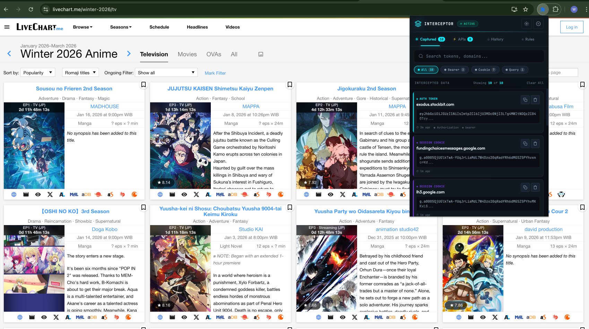
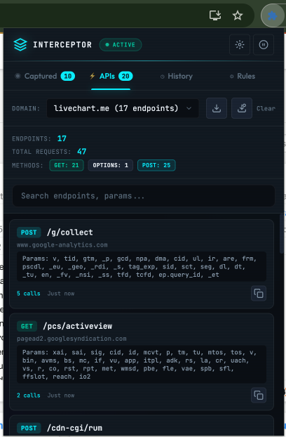

# Browser Interceptor

[](https://github.com/william2809/browser-interceptor/actions/workflows/ci.yml)
[](LICENSE)
[](SECURITY.md)

A **100% local** developer tool for intercepting and inspecting auth tokens from your own network requests. Like browser DevTools but more intuitive and focused on authentication debugging.

## Security Guarantee

**This extension is completely local. No data is ever sent externally.**

- All captured data is stored in `chrome.storage.local` only
- No network requests are made by this extension
- No analytics, telemetry, or external communication
- You can verify this by:
  - Searching the codebase: `grep -r "fetch\|XMLHttpRequest\|sendBeacon" src/`
  - Checking network traffic while using the extension
  - Reading the source code - it's fully transparent

## Features

- **Token Interception**: Automatically capture Bearer tokens, API keys, and auth headers
- **Cookie Extraction**: Extract session cookies and auth cookies
- **Query Parameters**: Capture api_key, access_token, and similar URL parameters
- **Token Rotation Detection**: Know when tokens are refreshed with rotation count tracking
- **Copy Formats**: One-click copy as raw value, header format, or cURL command
- **Domain Filtering**: Only capture from domains you specify (allowlist/blocklist)
- **Search & Filter**: Quick search and filter by token type
- **Custom Rules**: Add your own extraction rules for specific APIs

## Use Cases

- **Local Development**: Grab auth tokens to test APIs in Postman/Insomnia
- **API Debugging**: Understand what credentials your app is sending
- **Multi-Service Debug**: Track tokens across different microservices
- **Token Lifecycle**: Monitor when tokens refresh during development
- **Portfolio Projects**: Use your own credentials in custom analysis tools

## Screenshots




## Installation

### Load Unpacked (Chrome/Edge/Brave)

1. Clone this repository
2. Open the extensions page:
   - Chrome: `chrome://extensions/`
   - Edge: `edge://extensions/`
   - Brave: `brave://extensions/`
3. Enable "Developer mode" (toggle in the top right)
4. Click "Load unpacked"
5. Select the project directory (the folder that contains `manifest.json`)
6. Optional: Pin the extension from the toolbar

### Build & Test

```bash
# Install dependencies
npm install

# Run tests
npm test

# Run tests with coverage
npm run test:coverage

# Watch mode
npm run test:watch
```

## Configuration

### Domain Filtering

Configure which domains to capture from in Settings:

```javascript
// Only capture from your API domains
{
  "domainAllowlist": ["api.myapp.com", "*.mycompany.com"],
  "domainBlocklist": []
}

// Or block specific domains
{
  "domainAllowlist": [],  // Empty = capture all
  "domainBlocklist": ["analytics.example.com", "tracking.com"]
}
```

### Custom Rules

Add custom extraction rules for your specific APIs:

1. Click the "Rules" tab
2. Click "+ Add Rule"
3. Configure:
   - **Name**: Identifier for the rule
   - **URL Pattern**: Which URLs to match (e.g., `*://api.myapp.com/*`)
   - **Extract From**: header, cookie, or query
   - **Key Name**: The specific key to extract (e.g., `X-Custom-Auth`)

## Project Structure

```
browser-interceptor/
├── manifest.json          # Extension manifest (MV3)
├── src/
│   ├── background/
│   │   └── service-worker.js   # Request interception
│   ├── handlers/
│   │   ├── base-handler.js     # Base handler class
│   │   ├── auth-token-handler.js
│   │   ├── cookie-handler.js
│   │   ├── query-param-handler.js
│   │   ├── custom-handler.js
│   │   └── index.js            # Handler manager
│   ├── lib/
│   │   └── storage.js          # Local storage manager
│   └── popup/
│       ├── popup.html
│       ├── popup.css
│       └── popup.js
├── tests/
│   ├── setup.js               # Chrome API mocks
│   ├── storage.test.js
│   └── handlers.test.js
└── assets/
    └── icon-*.png
```

## How It Works

1. **Request Interception**: Uses `chrome.webRequest.onBeforeSendHeaders` to observe outgoing requests
2. **Pattern Matching**: Handlers check for auth-related headers, cookies, and query params
3. **Local Storage**: Captured tokens stored in `chrome.storage.local`
4. **Rotation Detection**: Same endpoint + different value = rotation detected
5. **Display**: Popup UI shows captured tokens with copy options

## API Reference

### Storage Functions

```javascript
// Get all captured tokens
const data = await getCapturedData();

// Update/add a token (handles rotation detection)
const { data, rotationDetected, previousToken } = await updateCapturedItem(key, value);

// Check if domain should be captured
const shouldCapture = shouldCaptureDomain('api.example.com', config);
```

### Handler Interface

```javascript
class MyHandler extends BaseHandler {
  matches(details) {
    // Return true if this handler should process the request
  }

  extract(details) {
    // Return array of extracted tokens
    return [{
      type: 'my-type',
      value: 'extracted-value',
      source: { domain, path }
    }];
  }
}
```

## Contributing

See [CONTRIBUTING.md](CONTRIBUTING.md) for setup instructions and contribution
workflow details. Please also review [SECURITY.md](SECURITY.md).

## Acknowledgments

- Thanks to the open-source community for the tools and inspiration that make
  browser extensions accessible.
- Portions of documentation and copy were drafted with the help of AI tools.

## License

MIT

---

**Note**: This tool is designed for developers to capture their own authentication tokens during development. It runs entirely in your browser and never transmits any data externally.
